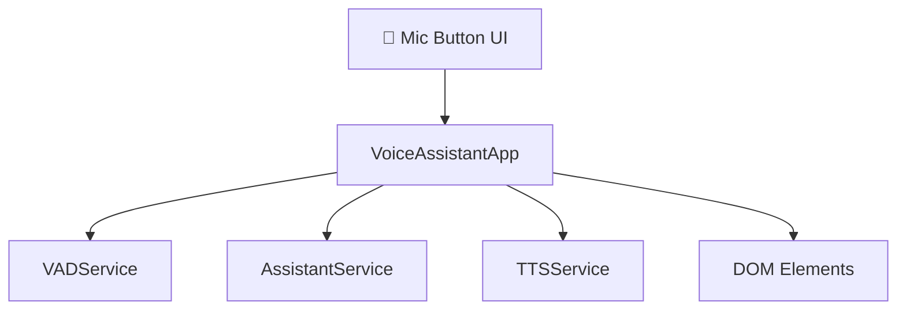
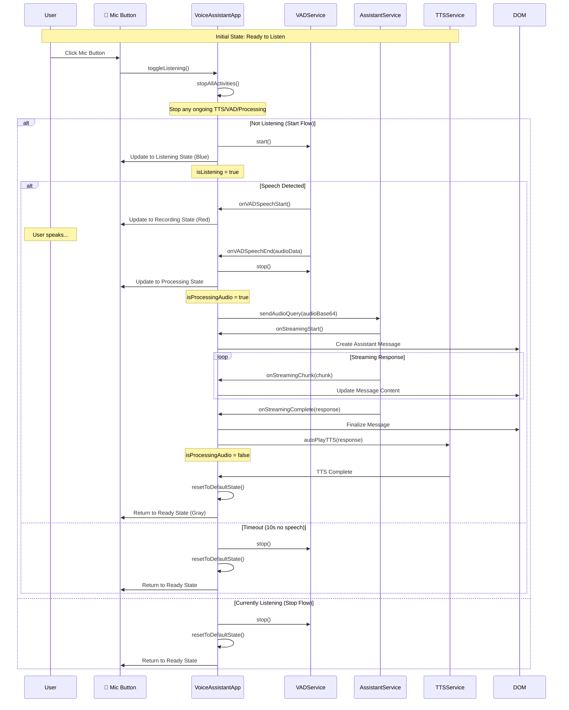
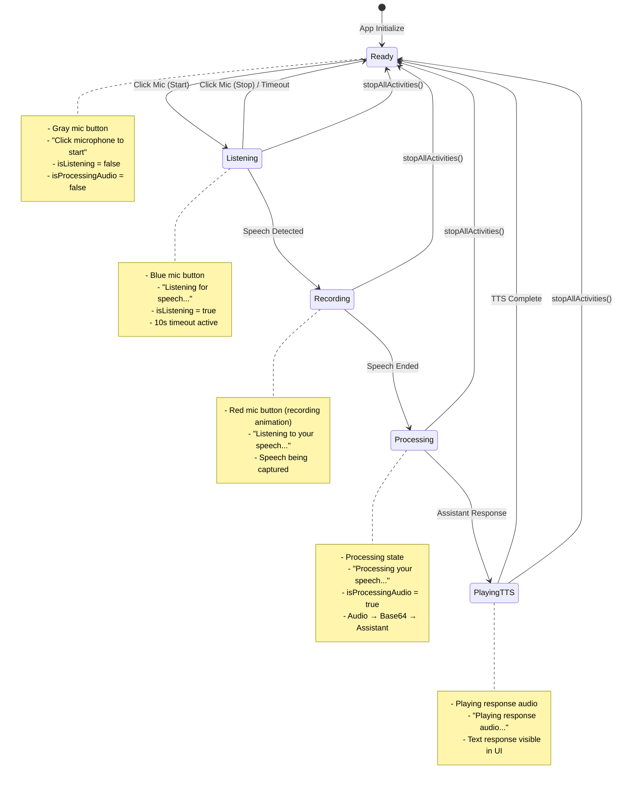

I'll create an architecture diagram in markdown showing the complete flow of your simplified voice assistant application:

```markdown
# Voice Assistant Architecture Flow

## System Components



## Main Application Flow



## State Management



## Key Features

### 🎯 **Click-to-Interrupt**
- Mic button press **always** stops all activities immediately
- Works in any state: Listening, Recording, Processing, or TTS playback
- Provides instant user control

### 🔄 **Conversation Persistence**
- Same conversation ID maintained throughout session
- No conversation reset on mic clicks
- Context preserved across interactions

### ⏱️ **Timeout Handling**
- 10-second timeout when listening for speech
- Auto-return to ready state if no speech detected
- Prevents hanging in listening mode

### 🎵 **Audio Flow**
- VAD captures speech → Base64 WAV conversion
- Assistant streaming response with real-time UI updates
- Auto-play TTS with voice: 'af_bella', model: 'hexgrad/Kokoro-82M'

## Service Responsibilities

| Service | Responsibility |
|---------|----------------|
| **VoiceAssistantApp** | Main orchestrator, state management, UI updates |
| **VADService** | Voice Activity Detection, speech capture |
| **AssistantService** | AI conversation, streaming responses |
| **TTSService** | Text-to-speech playback, audio management |

## Error Handling

```mermaid
graph TD
    Error[Any Error Occurs] --> Stop[stopAllActivities()]
    Stop --> Reset[resetToDefaultState()]
    Reset --> UI[Update UI to Ready State]
    UI --> Log[Log Error to Console]
```

All errors result in a clean return to the ready state, ensuring the app never gets stuck in an error condition.
```

This architecture shows your simplified voice assistant with:
- **Single-click activation/deactivation**
- **Immediate interruption capability**
- **Persistent conversation context**
- **Clean state management**
- **Robust error handling**

The flow is much cleaner than the original wake-word system, giving users direct control while maintaining conversation continuity.